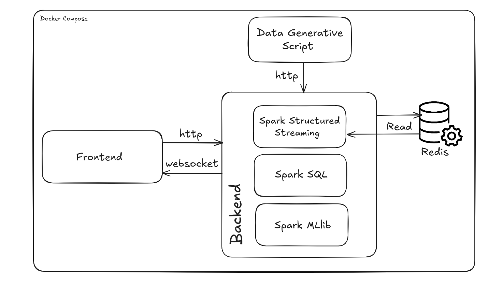

# Human Vital Signs Anomaly Detection & Risk Classification 🏥

This repository contains a Big Data application developed with **Apache Spark** to automatically classify clinical risk levels from human physiological data. 
The system leverages **Machine Learning** and **Ensemble Learning** techniques to categorize health measurements into risk classes, such as low, medium, or high.

## 📌 Project Overview
The application is designed to handle large-scale medical datasets and provides two primary processing workflows:
* **Batch Processing:** Analyzing historical data and performing complex clinical queries using **Spark SQL**.
* **Real-time Streaming:** Monitoring continuous data flows (simulated or sensor-based) using **Spark Structured Streaming** to provide immediate risk alerts.

## 📊 Dataset Features
The project utilizes the **Human Vital Sign Dataset** (approx. 200,000 measurements), focusing on the following key physiological parameters:
* **Heart Rate** and **Respiratory Rate**.
* **Blood Pressure** (Systolic and Diastolic).
* **Oxygen Saturation ($SpO_2$)** and **Body Temperature**.

## 🧠 Machine Learning Approach
To ensure high accuracy and robustness, the system implements an **Ensemble Learning** strategy.It combines several base learners through voting techniques:
* **Logistic Regression** and **Decision Tree Classifier**.
* **Support Vector Machine (SVM)** and **K-Nearest Neighbors (KNN)**.

Performance is evaluated using standard metrics including **Accuracy, Precision, Recall, F1-score**, and **ROC-AUC**.

## 🛠 Technology Stack
* **Core Engine:** Apache Spark (SQL, MLlib, Structured Streaming).
* **Data Analysis:** Spark SQL for descriptive and multivariate clinical queries.
* **Output:** Interactive dashboards featuring real-time statistics and model comparison.

---
## App Architecture



## How to Start

### Environment Variables

Before starting the application, set the following environment variables:

**App Service:**
- `DATASET_PATH`: Path to the dataset CSV file (default: `/app/src/data/human_vital_signs_dataset_2024.csv`)
- `SAVE_MODEL_PATH`: Path to save/load trained models (default: `/app/src/model/saved_models`)
- `REDIS_HOST`: Redis server host (default: `redis`)
- `REDIS_PORT`: Redis server port (default: `6379`)

**Stream Service:**
- `STREAM_GET`: URL endpoint for GET requests to the app service
- `STREAM_POST`: URL endpoint for POST requests to the app service
- `GEMINI_API_KEY`: API key for Google Gemini
- `GEMINI_API_MODEL`: Gemini model name to use

### Running the Application

To run the application, use Docker Compose:

```bash
docker-compose up --build 
```